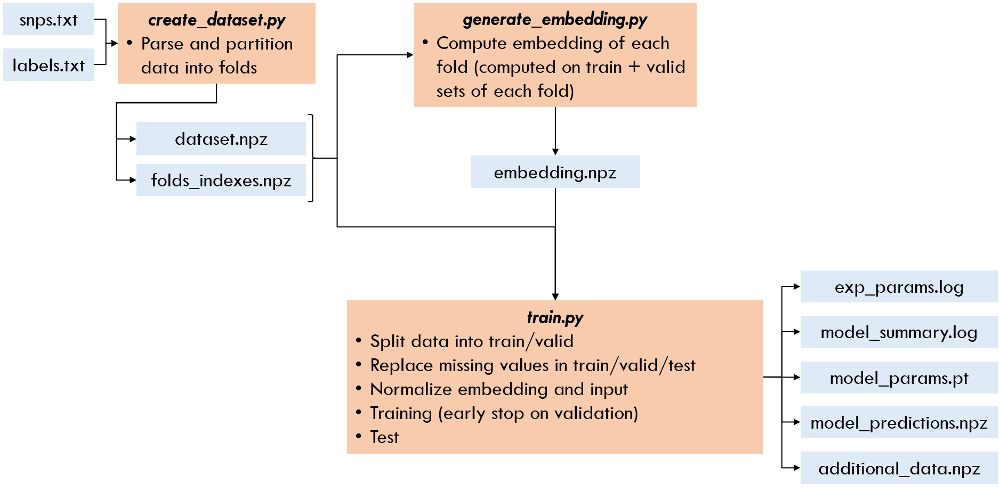

# DIETNETWORK

Pytorch implementation of DietNetwork (https://arxiv.org/abs/1611.09340)
## Training pipeline

## Scripts
### Main scripts
1. **create_dataset.py** : Create dataset and partition data into folds. The script takes snps.txt and labels.txt files as input to create dataset.npz and folds_indexes.npz
1. **generate_embedding.py** : Takes dataset.npz and folds_indexes.npz files created in the previous step and computes the embedding (genotypic frequency) of every fold. Embedding of each fold is saved in embedding.npz
    1. Missing values are -1 and are not included in the computation of genotypic frequencies embedding
    1. Embedding values are computed on train and valid sets
1. **train.py** : Whole training process. The data is divided in train/valid and test sets. Performance is reported on the test set.
    1. Data preprocessing of auxiliary net : Square Euclidean distance normalization
    1. Data preprocessing of discrim net: Missing values are replaced by the mean of the feature computed on training set. Data normalization (standardization) using mean and sd computed on training set.
1. **test_external_dataset.py** : Test model on an external set, ie on individuals that are not part of dataset.npz
1. **evaluate.py** : Utilities to visualize the model performance such as confusion matrix
  
### Helper scripts
- **dataset_utils.py** : Data related functions (shuffle, partition, split, get_fold_data, replace_missing_values, normalize, ...)
- **model.py** : Model definition of feature embedding (auxiliary) and discriminative (main) networks.
- **mainloop_utils.py** : Function used in the training loop (get_predictions, compute_accuracy, eval_step, ...)
- **log_utils.py** : Utilities to save data (model summary and parameters, experiment parameters, predictions, etc.)
- **test_utils.py** : Utilities related to testing a trained model on an external set

## Files
### Raw files provided by user
- **snps.txt** : File of genotypes in additive encoding format and tab-separated.
- **labels.txt** : File of samples and their label.
### Files created before training
- **dataset.npz** : Dataset created from the parsed snps.txt and labels.txt files.
- **folds_indexes.npz** : Array index (arrays are in dataset.npz) for each fold. The indexes are those of the data points to use as test.
- **embedding.npz** : Computed embeddings of each fold.
### Files returned after training
- **exp_params.log** : Experiment parameters (fixed seed, learning rate, number of epochs, etc.)
- **model_summary.log** : Model information (number of hidden layers, number of neurons in each layers, activation functions, etc.)
- **model_params.pt** : Model parameters of final trained model
- **model_predictions.npz**: Scores and predictions returned by the trained model for test samples
- **additional_data.npz** : Some more information used at training time (mus and sigmas values used for normalization, feature names, label names, training samples ids, validation samples ids, etc.) 

## To do
- [x] Embedding
- [x] Data preprocessing : Missing values
- [x] Data preprocessing : Data normalization
- [x] Dataset class (for dataloader)
- [x] Auxiliary and Main networks models
- [x] Training loop
- [x] Loss/Accuracy monitoring of train and valid
- [x] Early stopping
- [x] Test for in-sample data
- [ ] Test in-sample with missing values rates
- [x] Test for out-of-sample data
- [x] Save model params, results

## Packages
- Python 3.6
- torch 1.5.0+cu101
- numpy 1.19.1
- pandas 1.1.0
- matplotlib 3.2.1
- captum 0.2.0 (https://captum.ai/)
- h5py 2.10.0
